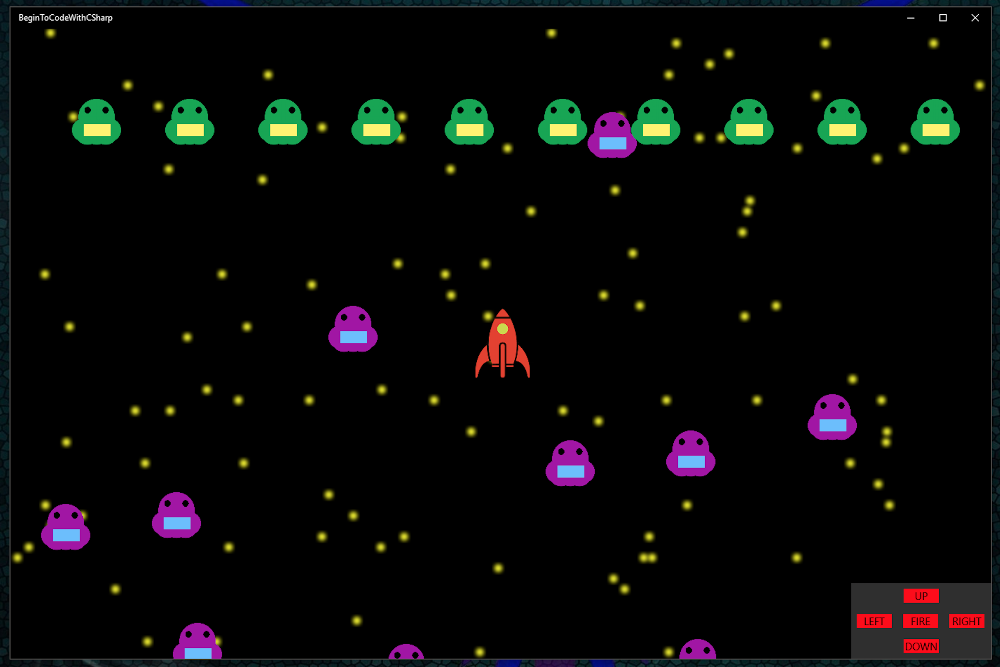

# Wake up Alien
```
This project was built on the back of a C# library provided in a book called
'Begin to code with C#' by Rob Miles.

This was one of my first introductions to the world of objects and how they
interact with each other.

Looking back I can see the the improvements that I have made. Specially having a
test driven development process in mind when working on projects.

The aim of the game is to shoot down all the green aliens whilst being chased by
one random purple alien. However, if you get too close to the another purple alien
you will wake it up and it will join the other alien in your pursuit.
```
## Screen shot of the game

